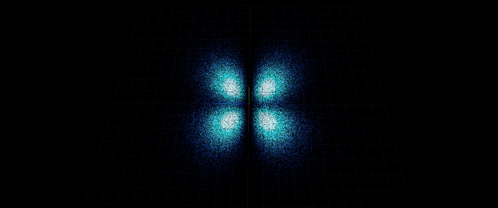
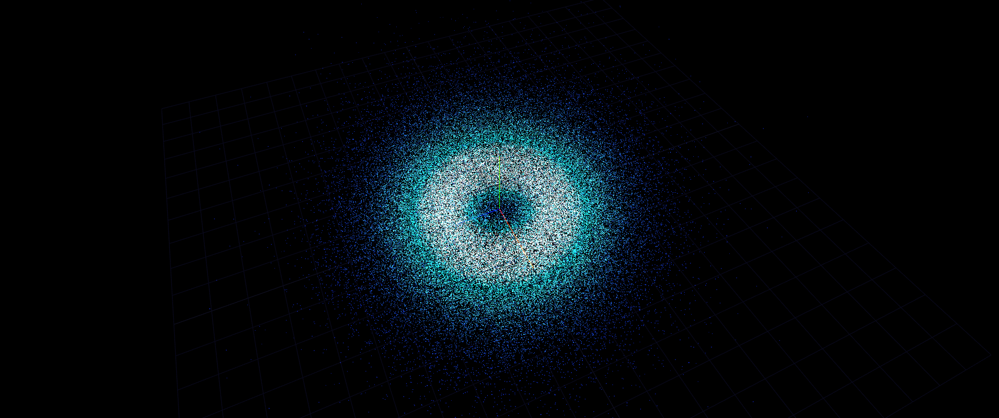
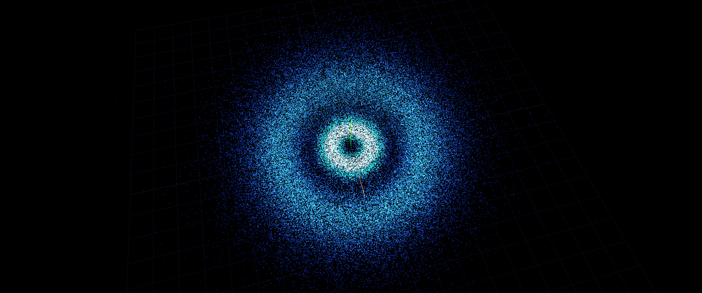
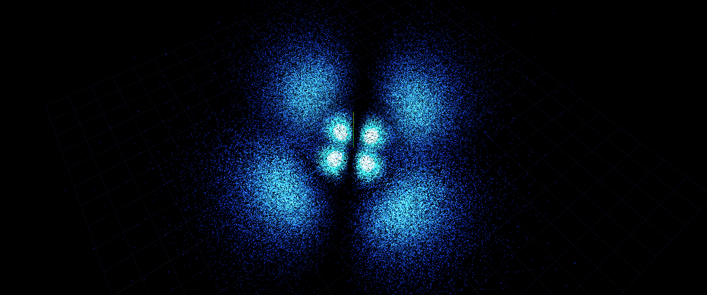
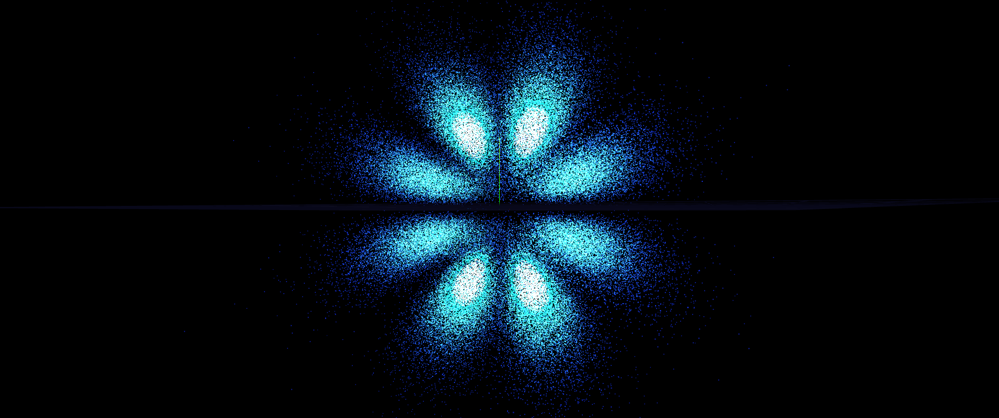

# Hydrogen orbitals on the GPU

A CUDA/C++ port of [kavan010/Atoms](https://github.com/kavan010/Atoms). The original draws hydrogen orbitals as clouds of particles in OpenGL. I wanted to see how far I could push it on the GPU, so I rewrote the sampling and both renderers in CUDA.

There are two programs, same as in the original:

- `atom_realtime` draws each particle as a small sphere, with a ground grid.
- `atom_raytracer` ray traces the particles with one point light and hard shadows.

Both sample particle positions from |ψ<sub>nlm</sub>|², color them by density, move them along the probability current, and write every frame as a PPM image. There's no window and no mouse input. Everything you could change with keys in the original is a command-line flag here.

## Pictures

These were made with a small Colab viewer I wrote on top of the same sampling code (`common/hydrogen.cuh`, `cdf.cuh`, `colormap.cuh`). A tiny CUDA program samples the particles and a three.js page draws them in the browser, so the colors and the grid look different from what the two programs here write out. The viewer itself is not in this repo.

It can also show real orbitals (the p<sub>x</sub> / d<sub>xy</sub> kind you see in chemistry books), not only the complex m states.

| | |
|---|---|
|  |  |
| n=2, l=1, m=0 | n=3, l=2, m=−2, real |
|  |  |
| n=3, l=2, m=−2, complex (a ring, since \|ψ\|² doesn't depend on φ) | n=4, l=2, m=2, complex (you can see the radial node) |
|  |  |
| n=4, l=2, m=2, real | n=5, l=4, m=1, real |

## Building

You need the CUDA toolkit (12.x, it already includes Thrust and cuRAND), CMake 3.24+, and a C++17 compiler that your CUDA version supports.

```sh
cmake -B build -S .
cmake --build build --config Release
```

By default CMake builds for the GPU in your machine. If you build somewhere without a GPU, set the architecture yourself, e.g. `-DCMAKE_CUDA_ARCHITECTURES=75` for a T4 or `86` for an RTX 30xx.

## Running

```sh
# one 800x600 frame of 2p (n=2, l=1, m=0), 250k particles
./build/atom_realtime

# 120 ray traced frames of 3p (n=3, l=1, m=1), camera turning 3 degrees per frame
./build/atom_raytracer --frames 120 --spin 3 --out frames_3p

./build/atom_realtime --help
```

Frames come out as `frame_00000.ppm`, `frame_00001.ppm`, ... To get a video or PNGs:

```sh
ffmpeg -framerate 30 -i frames_3p/frame_%05d.ppm -pix_fmt yuv420p orbital.mp4
magick frames_3p/frame_00000.ppm frame.png
```

Both programs take `--n --l --m --particles --frames --dt --width --height --radius --azimuth --elevation --spin --seed --out`. `atom_realtime` also has `--sphere-radius` and `--shaded`, and `atom_raytracer` has `--sphere-radius` and `--color-scale`.

If m = 0 the probability current is zero, so nothing moves. Use `--spin` if you still want an animation.

## Tests

`atoms_tests` runs on the CPU, so you don't need a GPU for it. It checks the math the kernels use: the hydrogen wave functions against textbook values, the inverse-CDF sampler, the camera, the sphere bounding boxes, and the BVH against brute force.

```sh
./build/atoms_tests
```

## How it works

**Sampling.** I tabulate the radial pdf r²R<sub>nl</sub>² and the polar pdf sin θ · P<sub>l</sub><sup>|m|</sup>(cos θ)² once on the CPU as CDFs (4096 and 2048 entries, same as the original). Then one thread per particle takes three random numbers from cuRAND (Philox, seeded per particle so every run gives the same cloud), looks up r and θ with a binary search in the CDFs, and picks φ uniformly.

**Motion.** Each particle keeps (r, θ, φ). For a state with magnetic number m, the probability current is just a rotation around the y axis with angular speed m / (r sin θ)², so each frame one kernel adds that to φ.

**Realtime renderer.** One thread per sphere finds the pixels the sphere covers, ray tests them, and writes the hit with a 64-bit `atomicMin` on `(depth << 32) | id`. Positive floats keep their order as integers, so this is a depth test and an id write in one atomic. A second pass turns ids into colors. Spheres smaller than a pixel still get drawn as one dot so they don't disappear.

**Ray tracer.** The original tests every pixel against every sphere, and does it twice because of the shadow ray. Here I build a linear BVH on the GPU every frame, following Karras (2012): Morton codes, sort, build the radix tree in parallel, then fit the boxes bottom-up. Traversal uses a small stack per thread. Shading is the same as the original: ambient plus Lambert from one point light, and a shadow ray that stops at the first hit.

## Things I changed on purpose

- **Negative m.** The original builds P<sub>l</sub><sup>m</sup> with the signed m, and the loop for P<sub>m</sub><sup>m</sup> only runs for m > 0, so m < 0 gave the wrong shape. I use |m|, since |Y<sub>l</sub><sup>−m</sup>| = |Y<sub>l</sub><sup>m</sup>|.
- **Sampling.** The original returns the left edge of the CDF bin, so all particles snap to a grid, and it integrates with a left Riemann sum. I interpolate inside the bin and use the trapezoid rule.
- **Motion.** I store spherical coordinates instead of getting θ back from `acos(y/r)` every frame, so r and θ don't drift over time.
- **Colors.** The two originals use slightly different purples. I use the ray tracer's in both.
- **Lighting in the realtime version.** The original computes a Lambert term in the vertex shader but never uses it, so everything is flat. Flat is still the default here, `--shaded` turns it on.
- **Quantum numbers.** In the original, changing n, l, m with the keyboard didn't rebuild the CDF tables, so the new shape was wrong. Here they are flags, so the tables always match.
- **Seed.** Fixed (`--seed`, default 42) so renders are reproducible.
