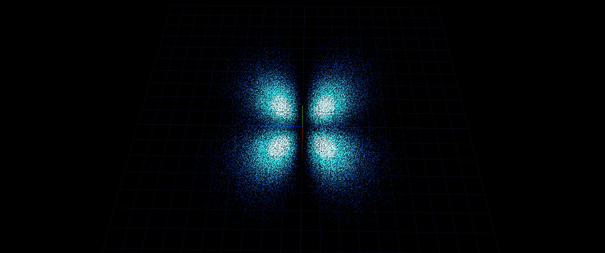
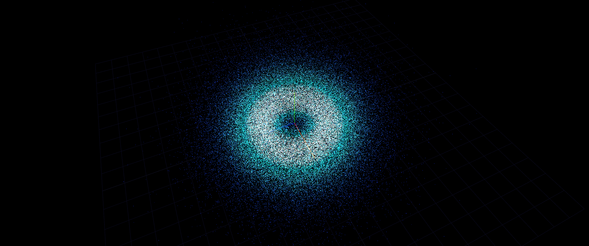
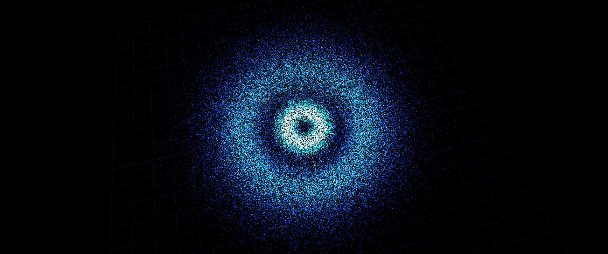
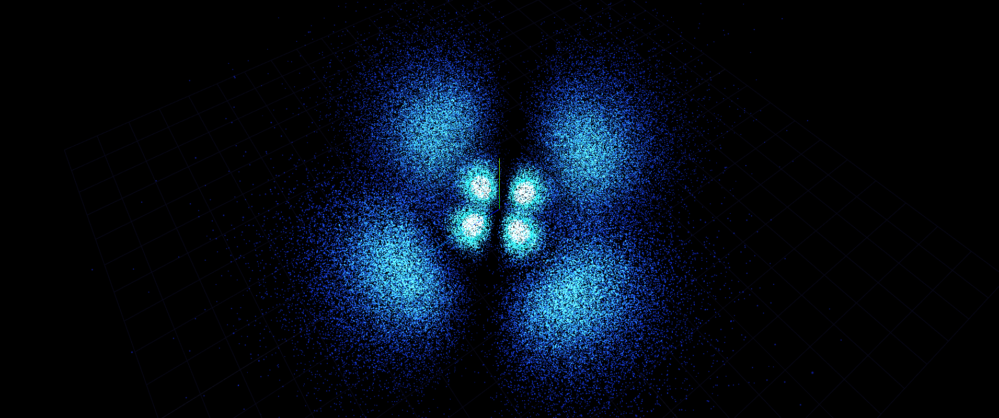
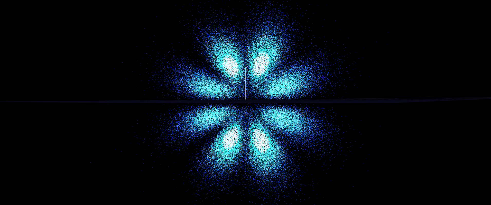

# Hydrogen orbitals on the GPU

A CUDA/C++ port of two of the programs in [kavan010/Atoms](https://github.com/kavan010/Atoms): `atom_realtime.cpp` and `atom_raytracer.cpp`. The original draws hydrogen orbitals as clouds of particles in an OpenGL window. Here the sampling, the particle motion and both renderers run in CUDA, and every frame is written to a PPM file. There is no window and no mouse or keyboard input.

The original repo also has other programs (a 2D version and `atom.cpp`). Those are not ported.

## What the programs do

- `atom_realtime` draws each particle as a small sphere, plus a ground grid. The name comes from the original. This version is not real time; it renders frames to disk.
- `atom_raytracer` ray traces the particles as spheres with one point light and hard shadows.

Both programs:

- sample particle positions from |ψ<sub>nlm</sub>|² for the complex hydrogen eigenstates (the usual e<sup>imφ</sup> states). Real orbitals (p<sub>x</sub>, d<sub>xy</sub> and so on) are not supported.
- color each particle by |ψ|² at its position with a black/purple/red/orange/yellow/white heatmap. By default the densest point of the orbital maps to the top of the heatmap.
- move the particles along the probability current, once per frame (also before the first frame).
- hide one quadrant of the cloud so you can see inside, like the original does. `atom_realtime` hides particles with x < 0 and y > 0. `atom_raytracer` hides particles with y > 0 and z > 0. There is no flag to turn this off.

Conventions: atomic units (a<sub>0</sub> = ħ = m<sub>e</sub> = 1), and the polar axis is **y**, not z.

## Pictures

**None of these pictures were made by the two programs in this repo.** They come from a separate Colab viewer I wrote, which is not in this repo. It uses the same sampling code (`common/hydrogen.cuh`, `cdf.cuh`, `colormap.cuh`) and draws the particles with three.js in the browser. So the colors, grid and cutaway look different from what `atom_realtime` and `atom_raytracer` write out. The viewer can also show real orbitals; the images marked "real" below can **not** be made with the code in this repo.

| | |
|---|---|
|  |  |
| n=2, l=1, m=0, complex | n=3, l=2, m=−2, real (viewer only) |
|  |  |
| n=3, l=2, m=−2, complex (a ring, since \|ψ\|² doesn't depend on φ) | n=4, l=2, m=2, complex (you can see the radial node) |
|  |  |
| n=4, l=2, m=2, real (viewer only) | n=5, l=4, m=1, real (viewer only) |

## Building

You need the CUDA toolkit (12.x; it includes Thrust and cuRAND), CMake 3.24+, and a C++17 compiler that your CUDA version supports.

```sh
cmake -B build -S .
cmake --build build --config Release
```

By default CMake builds for the GPU in your machine (`CMAKE_CUDA_ARCHITECTURES=native`). If you build somewhere without a GPU, set the architecture yourself, e.g. `-DCMAKE_CUDA_ARCHITECTURES=75` for a T4 or `86` for an RTX 30xx.

## Running

```sh
# one 800x600 frame of 2p (n=2, l=1, m=0), 250k particles, written to frames_realtime/
./build/atom_realtime

# 120 ray traced frames of 3p (n=3, l=1, m=1), 100k particles, camera turning 3 degrees per frame
./build/atom_raytracer --frames 120 --spin 3 --out frames_3p

./build/atom_realtime --help
```

Frames come out as `frame_00000.ppm`, `frame_00001.ppm`, ... in the output folder. To get a video or PNGs:

```sh
ffmpeg -framerate 30 -i frames_3p/frame_%05d.ppm -pix_fmt yuv420p orbital.mp4
magick frames_3p/frame_00000.ppm frame.png
```

Both programs take `--n --l --m --particles --frames --dt --width --height --radius --azimuth --elevation --spin --seed --out`. `atom_realtime` also has `--sphere-radius` (default 0.05·n/3) and `--shaded`. `atom_raytracer` also has `--sphere-radius` (default 0.25) and `--color-scale` (default 1 / peak |ψ|², so the densest point is white).

If m = 0 the probability current is zero, so nothing moves. Use `--spin` if you still want an animation.

## How it works

**Sampling.** I tabulate the radial pdf r²R<sub>nl</sub>² on [0, 10n²] and the polar pdf sin θ · P<sub>l</sub><sup>|m|</sup>(cos θ)² on [0, π] once on the CPU, as CDFs with 4096 and 2048 entries (same sizes and radial cutoff as the original). One GPU thread per particle draws three uniform numbers from cuRAND Philox (one seed for the whole cloud, one subsequence per particle), finds r and θ with a binary search in the CDFs plus linear interpolation inside the bin, and picks φ uniformly. With the same seed and particle count you get the same cloud.

**Motion.** Each particle keeps (r, θ, φ). For a state with magnetic number m, the probability current only has a φ component, v<sub>φ</sub> = m / (r sin θ). So each frame one kernel adds Δφ = m·dt / (r sin θ)² to φ. r and θ never change. Particles exactly on the axis are left where they are.

**`atom_realtime` renderer.** One thread per visible sphere loops over the pixels its screen box covers, ray tests them, and writes the hit with a 64-bit `atomicMin` on `(depth << 32) | id`. Positive floats keep their order when read as integers, so this does the depth test and the id write in one atomic. A second pass turns ids into colors. Spheres too small to cover any pixel center are still drawn as one pixel. The grid is drawn by a per-pixel kernel into the same depth buffer.

**`atom_raytracer` renderer.** The original tests every pixel against every sphere, for the primary ray and again for the shadow ray. Here a linear BVH is rebuilt on the GPU every frame, following Karras (2012): Morton codes, sort, build the radix tree in parallel, then fit the boxes bottom-up. Traversal uses a fixed stack of 64 entries per thread. Shading is the same as the original: ambient plus Lambert from one point light, and a shadow ray that stops at the first hit.

## Things I changed on purpose

- **Negative m.** The original builds P<sub>l</sub><sup>m</sup> with the signed m, and the loop for P<sub>m</sub><sup>m</sup> only runs for m > 0, so m < 0 gave the wrong shape. I use |m|, since |Y<sub>l</sub><sup>−m</sup>| = |Y<sub>l</sub><sup>m</sup>|.
- **Sampling.** The original returns the CDF grid point found by `lower_bound`, so all particles snap to a grid, and it builds the CDF with a plain running sum (left Riemann sum). I interpolate inside the bin and use the trapezoid rule.
- **Motion.** The original takes a Cartesian Euler step with v<sub>φ</sub> and then recovers φ with `atan2` and θ with `acos(y/r)` every frame. I store spherical coordinates and add the exact Δφ, so r and θ don't drift. For small steps both give the same motion; close to the axis they differ.
- **Color scale.** The original scales |ψ|² by hand-picked constants (1.5·5<sup>n</sup> in the realtime version, 700 in the ray tracer). I divide by the peak |ψ|² of the orbital, so the colors use the full heatmap for any n, l, m.
- **Colors.** The two originals use slightly different purples. I use the ray tracer's in both.
- **Lighting in `atom_realtime`.** The original computes a Lambert term in the vertex shader but never uses it, so everything is flat. Flat is still the default here; `--shaded` turns it on.
- **Quantum numbers.** In the original, changing n, l, m with the keyboard didn't rebuild the CDF tables, so the new shape was wrong. Here they are flags, so the tables always match.
- **Seed.** Fixed (`--seed`, default 42) so renders are reproducible.

## Limitations

- Output is PPM frames only. No window, no interaction.
- Only complex eigenstates, no real orbitals.
- The cutaway quadrant is hard-coded.
- There are no automated tests in this repo right now.
- I have not published timing numbers, so there is no measured speedup against the original here.
